# SOC Home Lab

A self-built Security Operations Center lab, simulating a small enterprise network with a domain controller, a SIEM server, a monitored client, and an attacker machine. Built to practice log collection, agent deployment, and basic attack/detection workflows.

## Architecture

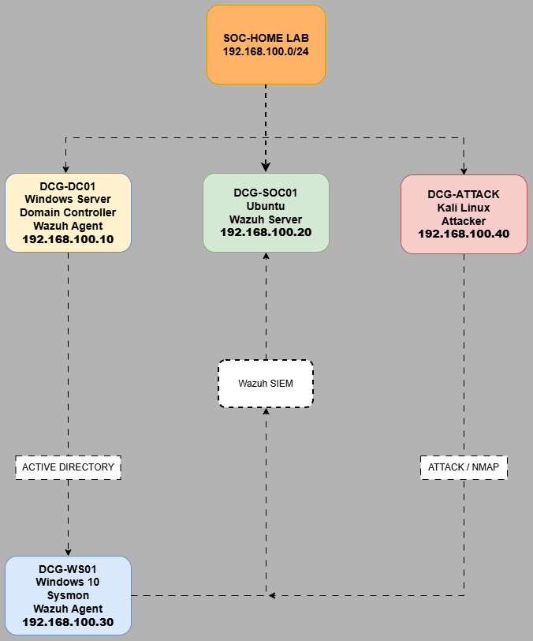

Network: `192.168.100.0/24` | Domain: `corp.local`

| Machine | Role | IP | OS |
|---|---|---|---|
| DCG-DC01 | Domain Controller | 192.168.100.10 | Windows Server 2022 |
| DCG-WS01 | Workstation (domain-joined, Wazuh agent, Sysmon) | 192.168.100.20 | Windows 10 Enterprise |
| DCG-SOC01 | Wazuh SIEM server | 192.168.100.30 | Ubuntu |
| DCG-ATTACK | Attacker machine | 192.168.100.40 | Kali Linux |

All four VMs sit on the same internal network so the attacker box, endpoints, and SIEM can talk to each other exactly as they would in a real environment.

## Windows Server / Active Directory

Built out a full AD structure on `corp.local`, with Organisational Units for each business function (Finance, HR, IT, Sales, SOC), matching security groups, and user accounts.

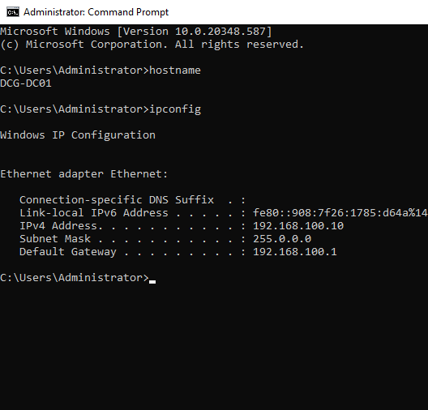

**OU structure:**

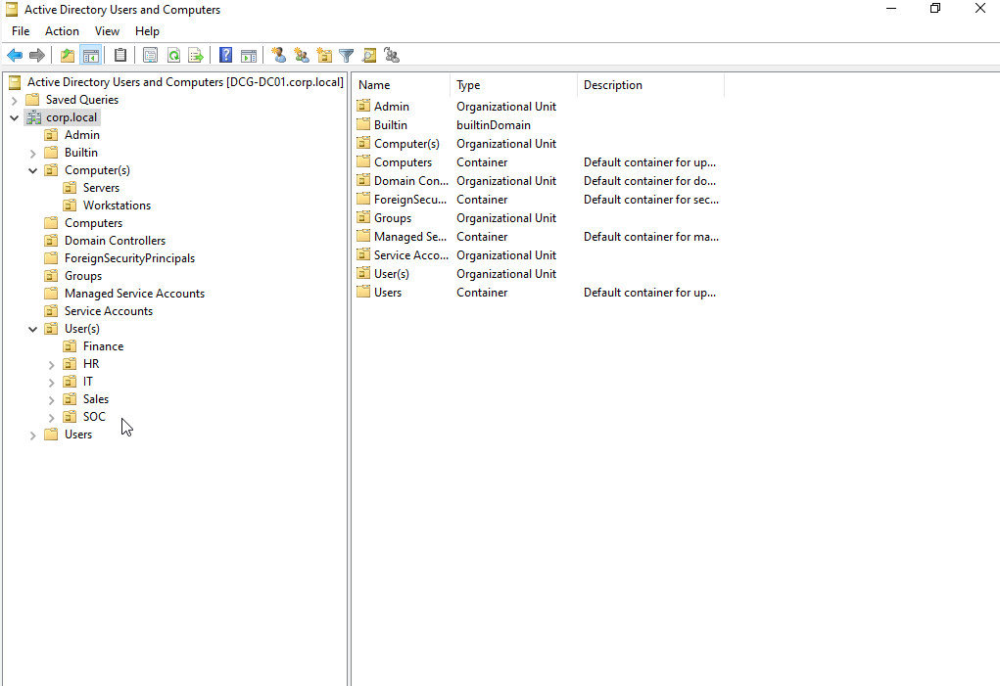

**Security groups** (one global group per OU — Finance_Users_GG, HR_Users_GG, IT_Admins_GG, Sales_Users_GG, Soc_Analysts_GG):

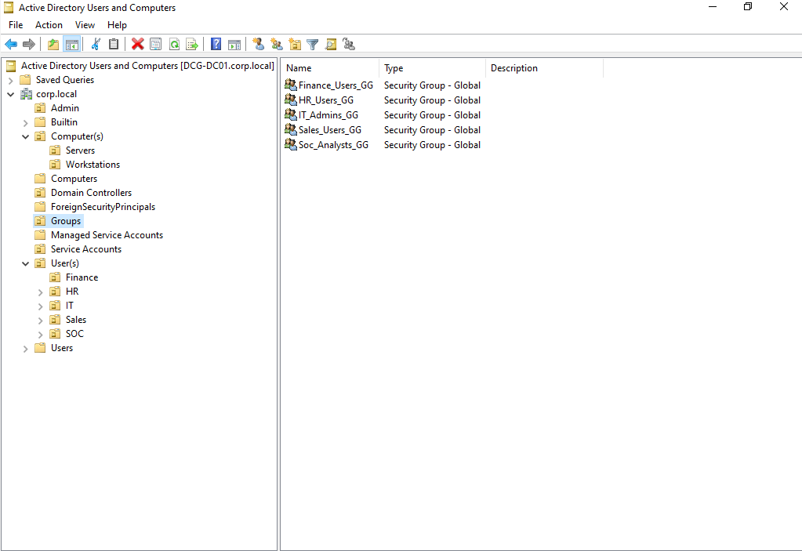

**User accounts** — example user provisioned under the SOC OU:

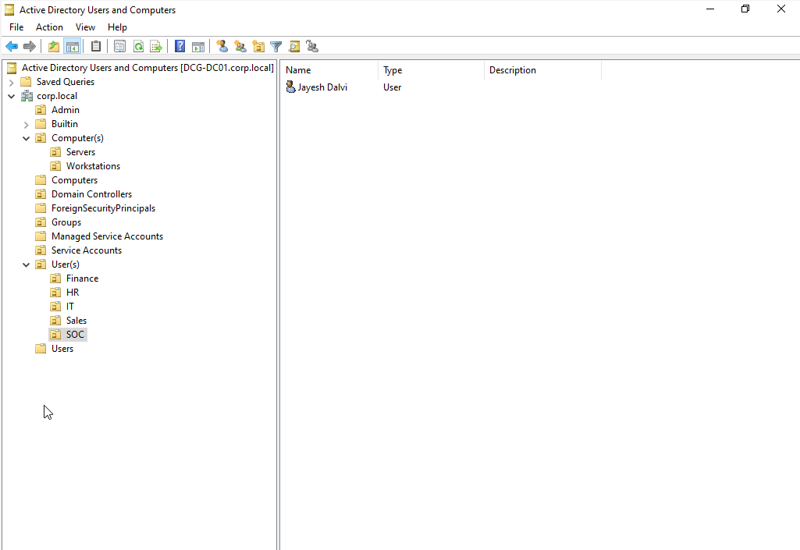

## Windows 10 Endpoint

Domain-joined client running the Wazuh agent for log forwarding and Sysmon for detailed process/network telemetry.

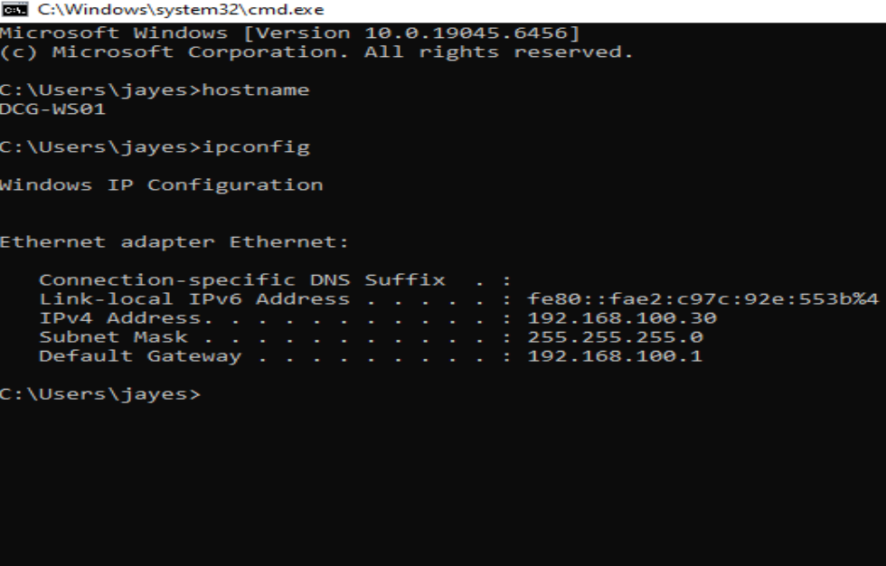

**Sysmon logging in action** — a DNS query event (Event ID 22) captured on the workstation and forwarded through Windows Event Viewer:

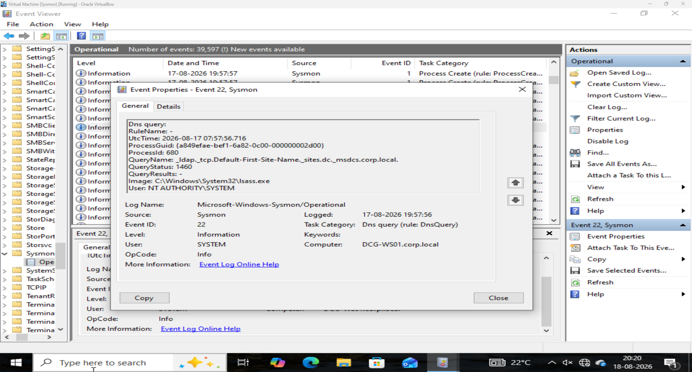

## Wazuh SIEM (Ubuntu)

Central server for log collection, correlation, and alerting. Confirmed the Wazuh manager service is active and both endpoints (workstation and domain controller) are connected as agents.

**Server network configuration:**

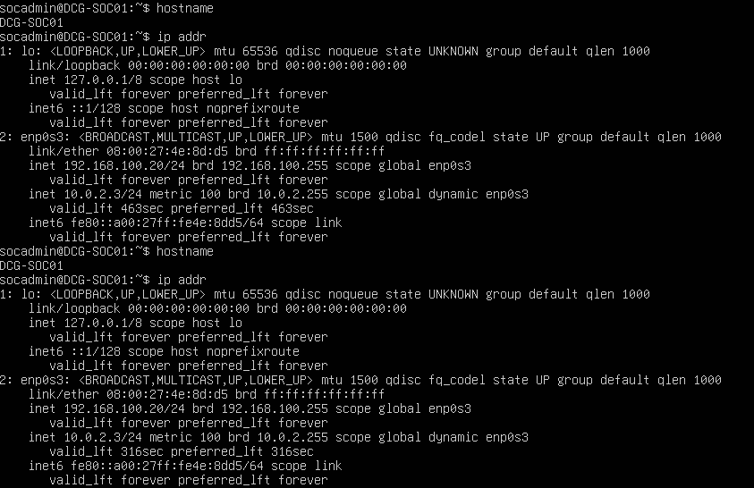

**Wazuh manager service status:**

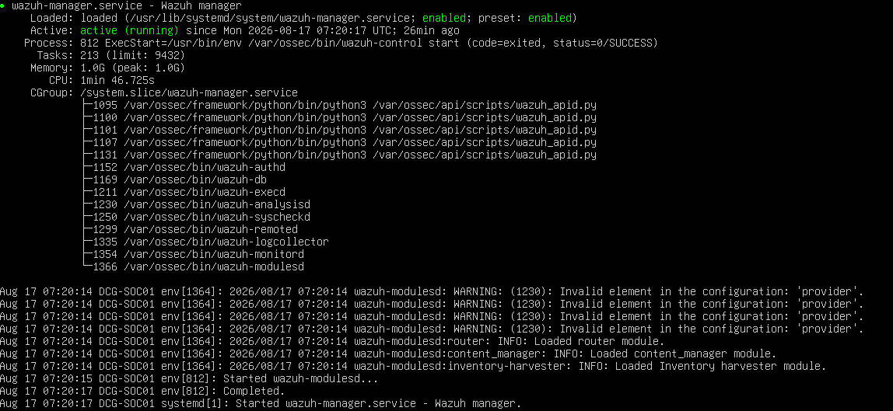

**Connected agents** — both endpoints reporting in as active:

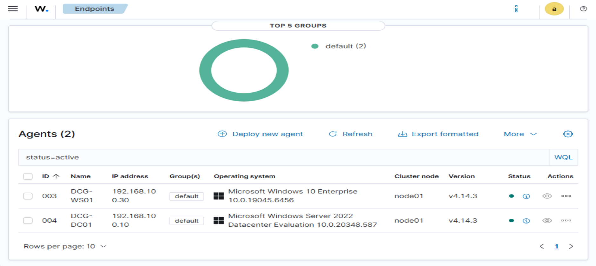

## Kali Linux (Attacker Machine)

Positioned on the same subnet as the rest of the lab. Confirmed connectivity to the domain controller, workstation, and SIEM server before running any simulated attacks against them.

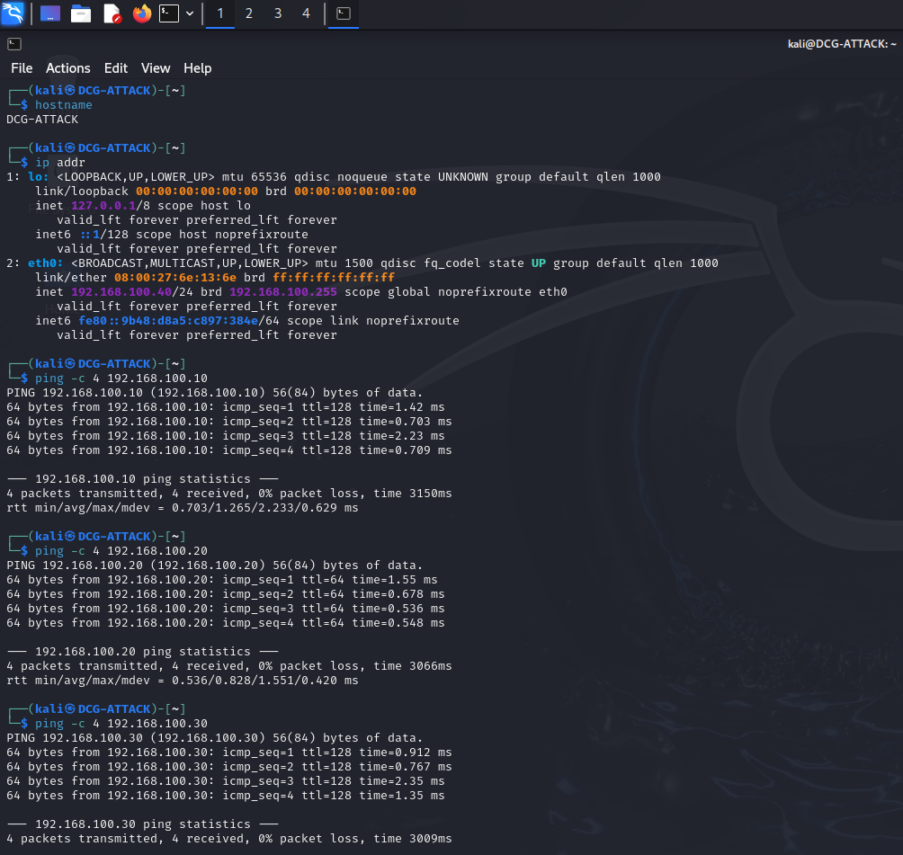

## What this lab demonstrates

- Standing up Active Directory from scratch: OUs, security groups, and users
- Deploying and configuring a Wazuh SIEM, including agent enrollment
- Configuring Sysmon for endpoint telemetry
- Building a small isolated attack range and validating network reachability between all components
- Troubleshooting real issues along the way: agent disconnections from manager IP misconfiguration in `ossec.conf`, Kerberos time-sync failures blocking domain join, and Sysmon event forwarding

## Tools used

VirtualBox, Windows Server 2022, Windows 10, Ubuntu, Kali Linux, Wazuh, Sysmon, Active Directory, PowerShell

---

**Author:** Jayesh Dalvi
[LinkedIn](https://www.linkedin.com/in/jayesh-dalvi-a114b079/) | [GitHub](https://github.com/jayesh-dalvi)
