# RDP Brute Force Detection — SOC Home Lab

Part of my [SOC Home Lab](https://github.com/jayesh-dalvi/SOC_LAB) project.

## Overview

This investigation simulates a brute force attack against RDP (port 3389) on a Windows 10 workstation (DCG-WKS01) using Hydra from a Kali Linux attack box (DCG-ATTACK). The goal was to generate the attack traffic, capture it at the network level, confirm host-level detection via Sysmon, and verify Wazuh correctly alerted on both the failed and successful authentication attempts.

**MITRE ATT&CK mapping:** T1110 (Brute Force), T1021.001 (Remote Services: RDP), T1078 (Valid Accounts)

## Lab environment

| Machine | Role | IP |
|---|---|---|
| DCG-ATTACK | Kali Linux — attacker | 192.168.100.40 |
| DCG-WKS01 | Windows 10 — target workstation | 192.168.100.30 |
| DCG-SOC01 | Ubuntu — Wazuh manager/SIEM | 192.168.100.20 |

**Target account:** a local test account (`socuser`) was created on DCG-WKS01 specifically for this exercise and added to the Remote Desktop Users group, so the attack didn't touch any real user credentials.

## Setup

Two things needed to be confirmed/fixed before the attack would be visible end-to-end:

**1. Sysmon coverage.** While reviewing the active Sysmon config on DCG-WKS01, I found the `ProcessAccess` (Event ID 10) section was present but empty — meaning process-access events (like LSASS access, relevant to a separate credential-dumping scenario in this lab) weren't being logged at all.

`ProcessAccess` section before the fix:

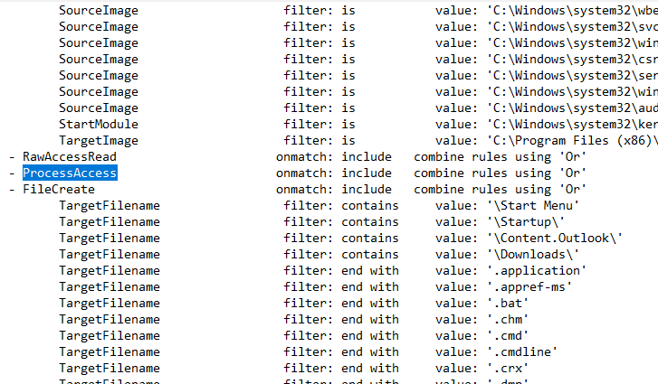

Located the correct section in the config XML and added a rule targeting `lsass.exe`:

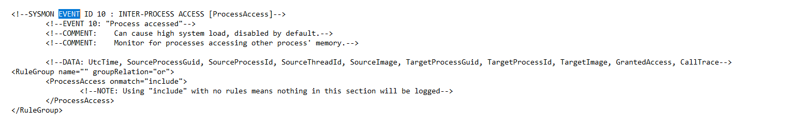

This isn't directly required for the RDP brute-force scenario below, but it was a detection gap worth fixing while auditing the lab's Sysmon coverage.

**2. Wazuh agent forwarding the Windows Security event channel.** Confirmed `ossec.conf` on DCG-WKS01 already had a `<localfile>` block pointing at the `Security` channel, with a query excluding a handful of noisy event IDs (permission changes, file access, etc.). Event ID 4625 (failed logon) and 4624 (successful logon) were **not** in that exclusion list, so they were already flowing through to Wazuh without any changes needed.

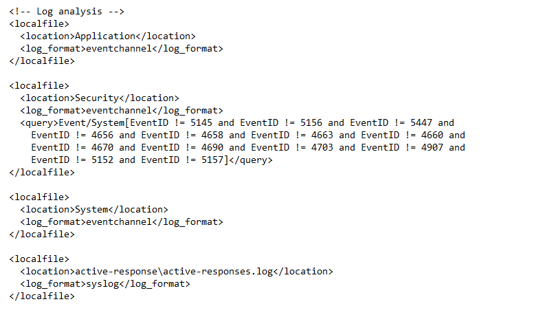

**3. RDP access for the test account.** By default, local accounts aren't permitted to log on via RDP even with correct credentials. Added `socuser` to the Remote Desktop Users group and confirmed RDP was listening on port 3389:

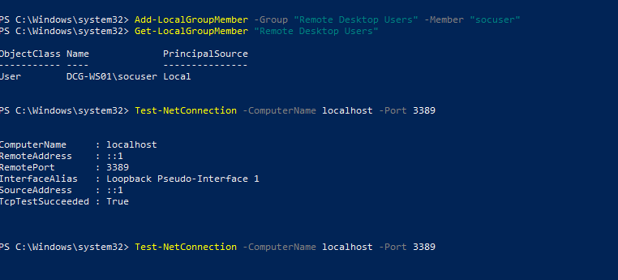

## Attack

From DCG-ATTACK, a small custom password list (rather than a full wordlist) was used to keep the traffic and resulting logs readable for this writeup:

```bash
hydra -l socuser -P passwords.txt rdp://192.168.100.30
```

Hydra's RDP module proved unreliable in this environment (an experimental module by the tool's own documentation), and Ncrack — tried as an alternative — stalled indefinitely against the same target. Despite this, the failed-login evidence from the attempts that did register was captured cleanly across all three tools below. A final successful login was produced separately using FreeRDP:

```bash
xfreerdp3 /u:socuser /p:'<correct password>' /v:192.168.100.30 /cert:ignore
```

This gave a clean "before → after" picture: repeated failed attempts, followed by one successful authentication.

## Evidence

### 1. Network capture (Wireshark)

During the failed attempts, DCG-WKS01 responded to each connection with a TCP RST/ACK — visible as a burst of resets on port 3389 from the target back to the attacker within milliseconds of each other:

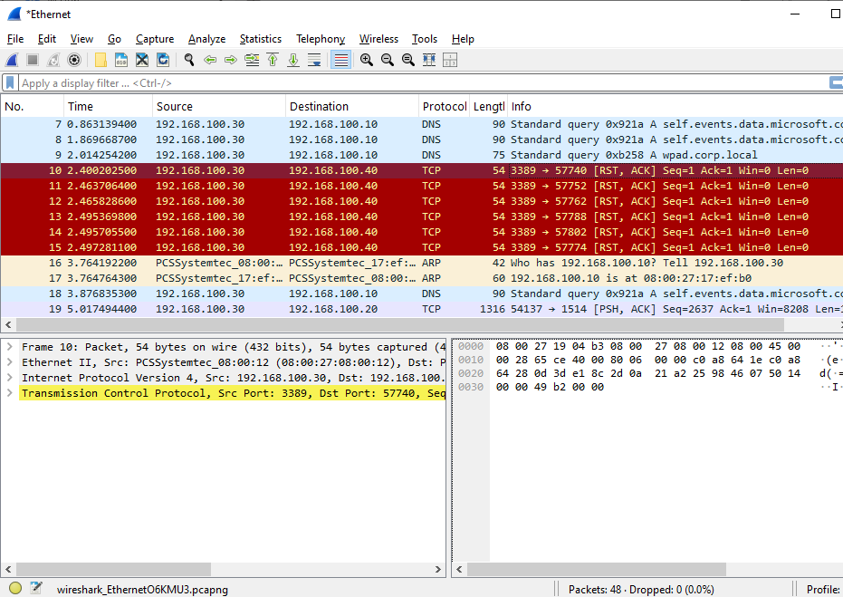

Packet-level detail of one of these resets, confirming source/destination and port:

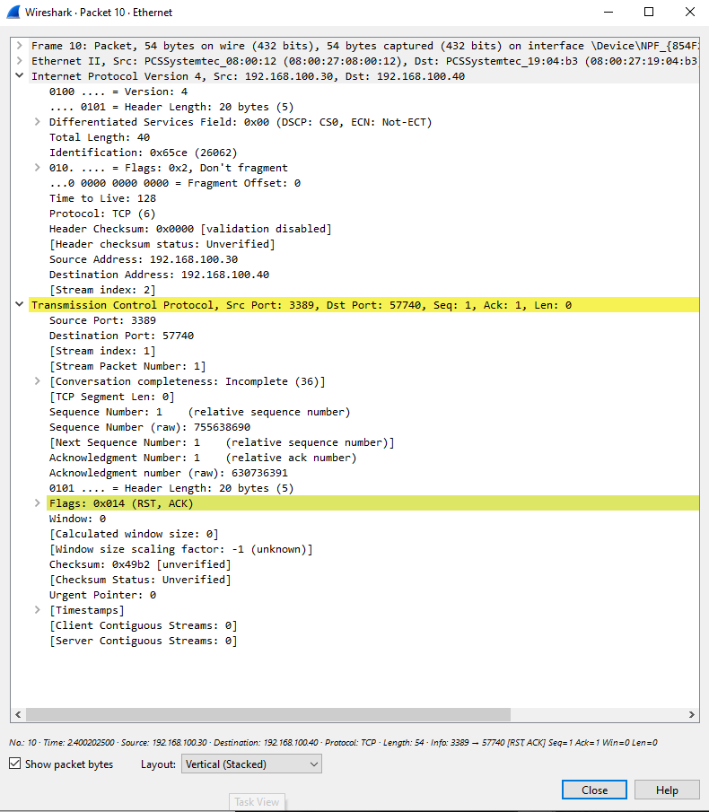

This rapid connect/reset pattern against a single port from a single source is a straightforward network-level indicator of a brute force attempt, independent of anything happening on the host itself.

### 2. Host telemetry (Sysmon)

Sysmon Event ID 3 (Network Connection) independently confirmed the inbound connections, tying them to the process handling them on the target:

- **RuleName:** RDP
- **Image:** `C:\Windows\System32\svchost.exe`
- **SourceIp:** 192.168.100.40
- **DestinationIp:** 192.168.100.30
- **DestinationPort:** 3389 (`ms-wbt-server`)

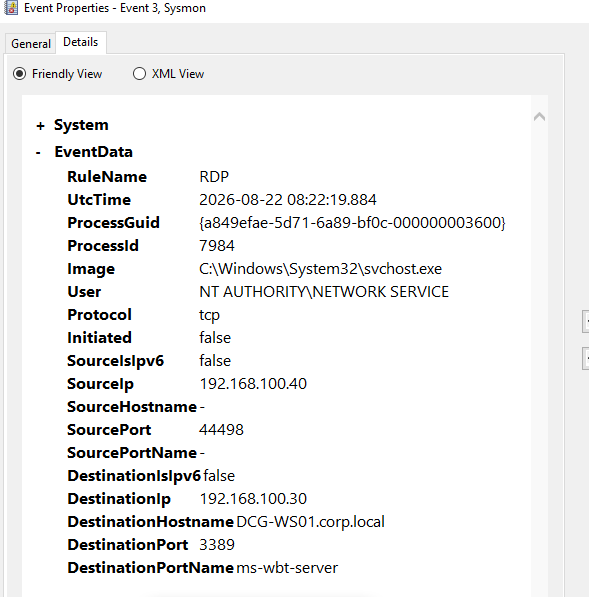

This confirms the network activity seen in Wireshark corresponds to real inbound RDP connection attempts on the host, not just noise on the wire.

### 3. SIEM detection (Wazuh)

Wazuh's agents summary and alert dashboard for the lab:

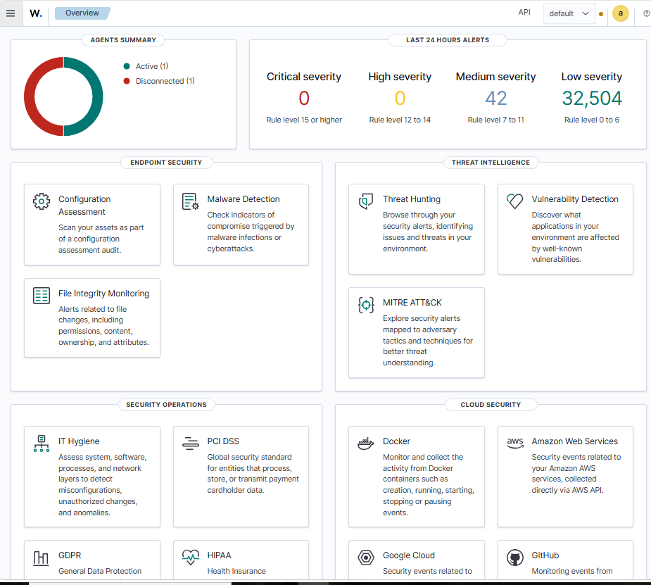

**Failed attempts — Event ID 4625.** Threat Hunting showed 12 hits over the attack window, all matched to built-in rule **60122** ("Logon Failure — Unknown user or bad password", level 5):

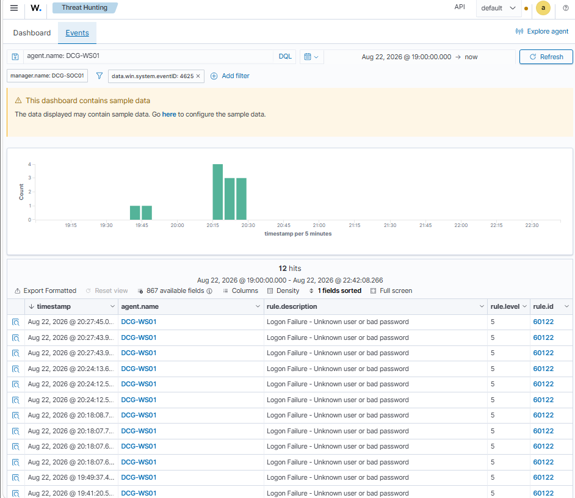

Detail of one event, confirming the attacker's identity and the type of logon attempted:

- `targetUserName`: socuser
- `ipAddress`: 192.168.100.40
- `workstationName`: DCG-ATTACK
- `logonType`: 3 (Network)
- `authenticationPackageName`: NTLM
- `status` / `subStatus`: 0xc000006d / 0xc000006a (bad username or password)

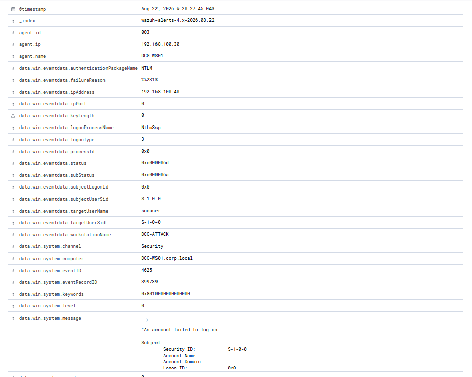

**Successful login — Event ID 4624.** The FreeRDP session completing successfully:

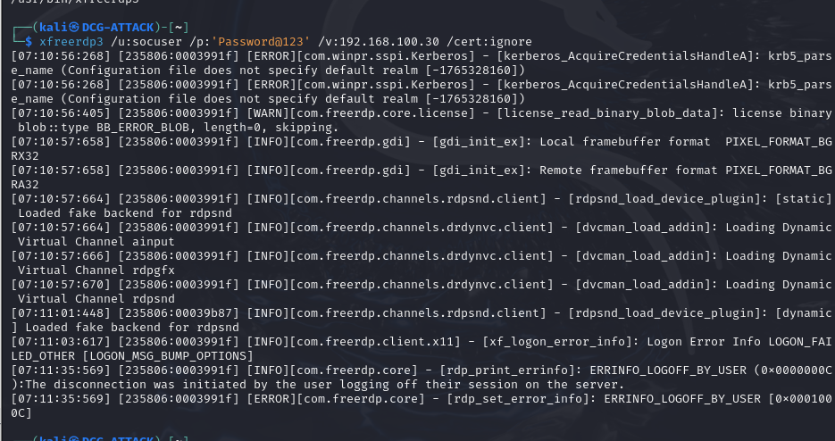

Wazuh's dashboard for this window showed 14 authentication-success events and auto-mapped the activity under **MITRE ATT&CK** techniques including Valid Accounts, Remote Desktop Protocol, Domain Accounts, and Pass the Hash:

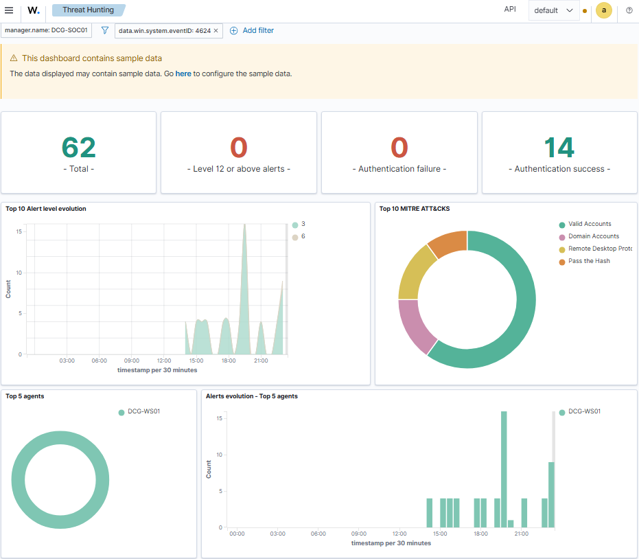

Detail of the matching successful-logon event for `socuser`:

- `targetUserName`: socuser
- `ipAddress`: 192.168.100.40
- `logonType`: 10 (RemoteInteractive)
- `authenticationPackageName`: Negotiate
- `severityValue`: AUDIT_SUCCESS

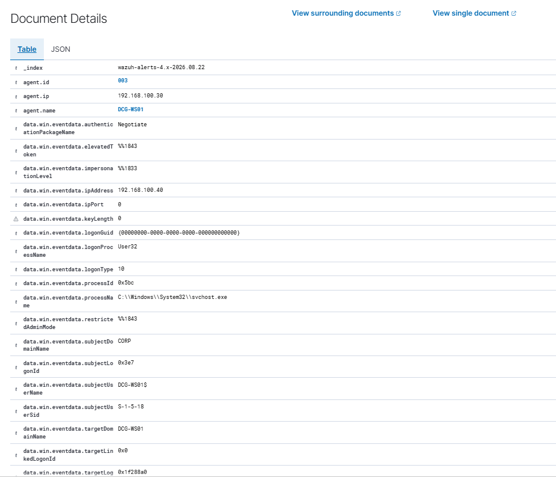
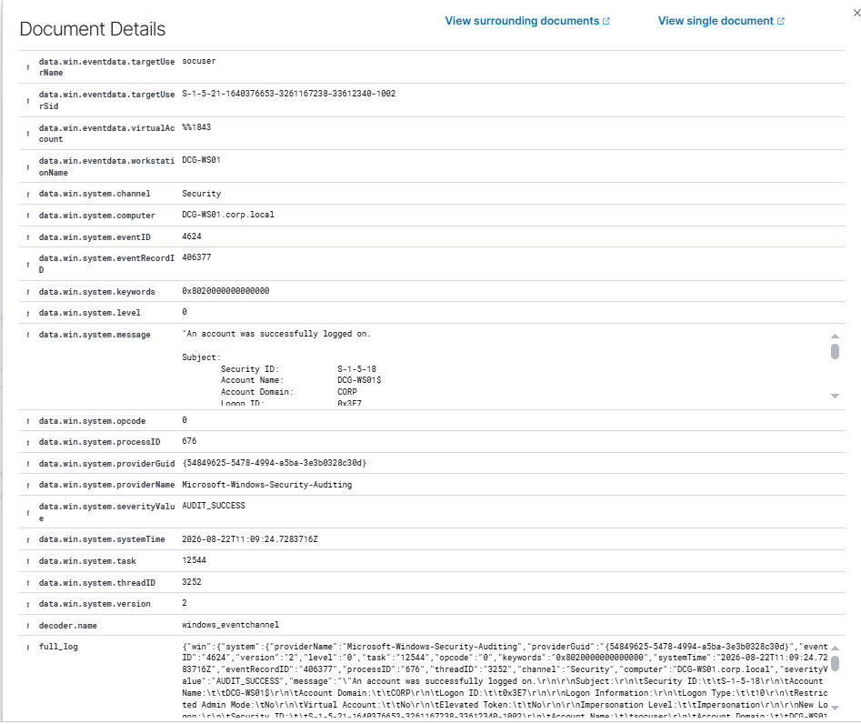

The difference in `logonType` between the failed attempts (3, Network) and the successful one (10, RemoteInteractive) is worth noting — it reflects the difference between the brute-force tool's raw authentication attempts and a full interactive RDP session being established.

## Summary

| Stage | Wireshark | Sysmon | Wazuh |
|---|---|---|---|
| Failed attempts | TCP RST/ACK bursts on port 3389 | Event ID 3, svchost.exe, port 3389 | 12x Event ID 4625, rule 60122 |
| Successful login | Full TCP handshake | Event ID 3 | Event ID 4624, logonType 10 |

This exercise demonstrates detection of a brute force attack from three independent angles — network, host, and SIEM — and shows how the same activity looks different depending on which layer it's observed from. It also involved a real gap-finding step (the empty Sysmon `ProcessAccess` rule) that had to be fixed before the lab's overall detection coverage was actually complete.

## Notes / lessons learned

- Hydra's RDP module is explicitly marked experimental and was unreliable against this target; Ncrack was also tried but stalled indefinitely on this setup. FreeRDP (`xfreerdp3`) was the most reliable client for confirming a successful login.
- Local accounts aren't granted RDP access by default — they need to be added to the **Remote Desktop Users** group before they can log on remotely, even with correct credentials.
- Network Level Authentication (NLA) can interfere with some brute-force tooling; it was disabled here for lab testing purposes only and would not be a realistic setting to disable in a production environment.
- Reviewing the active Sysmon config directly (rather than assuming a downloaded base config covers everything) surfaced a real detection gap — a good reminder to verify config coverage rather than assume it.
